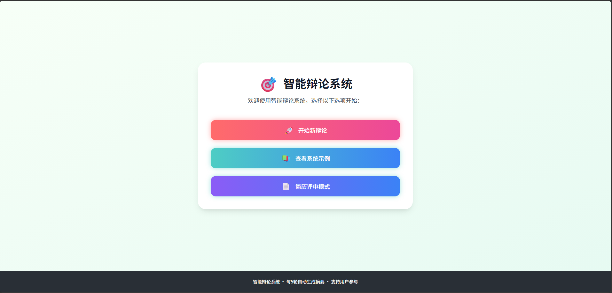
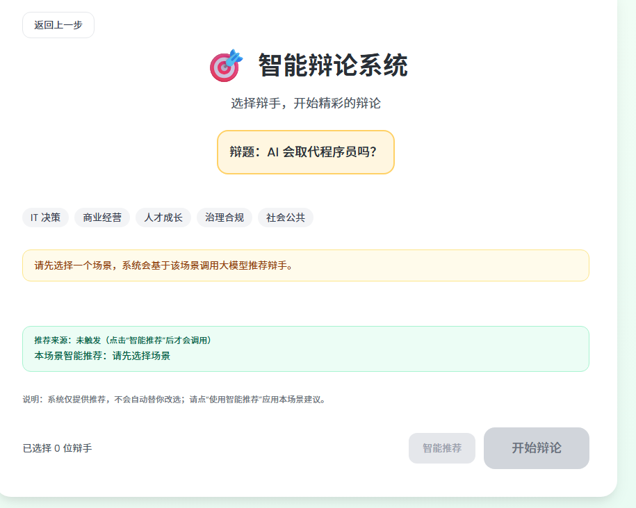
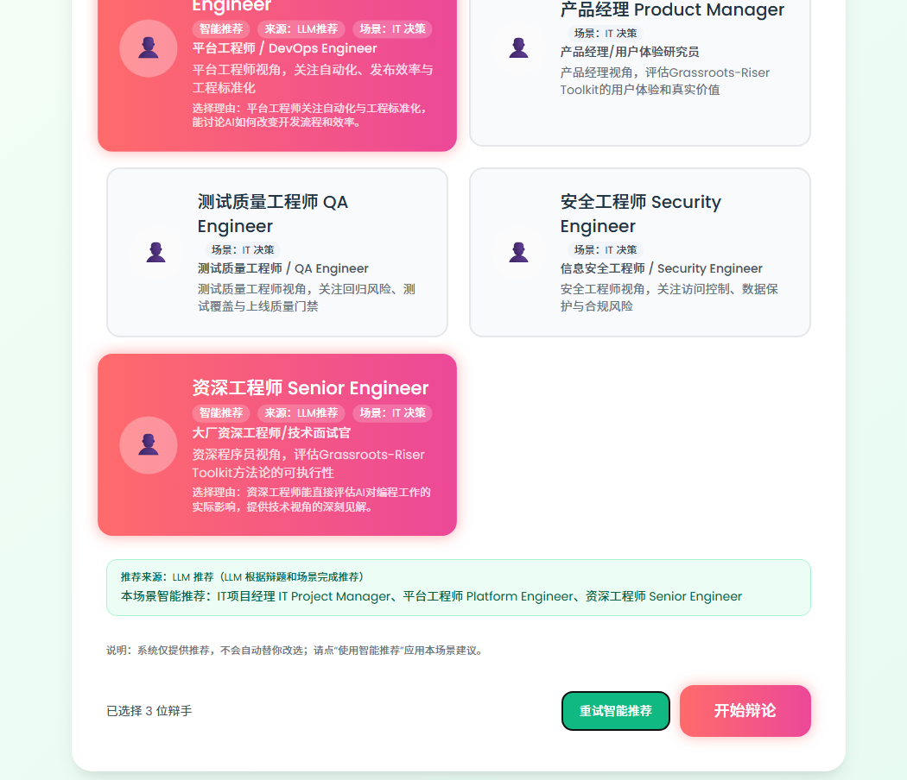
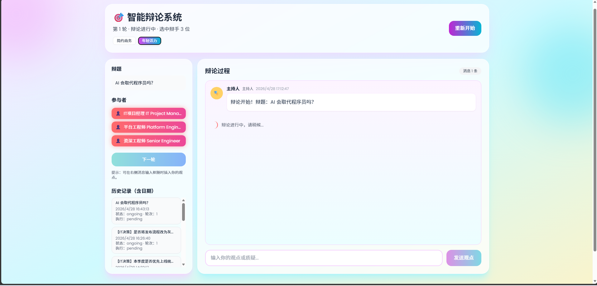
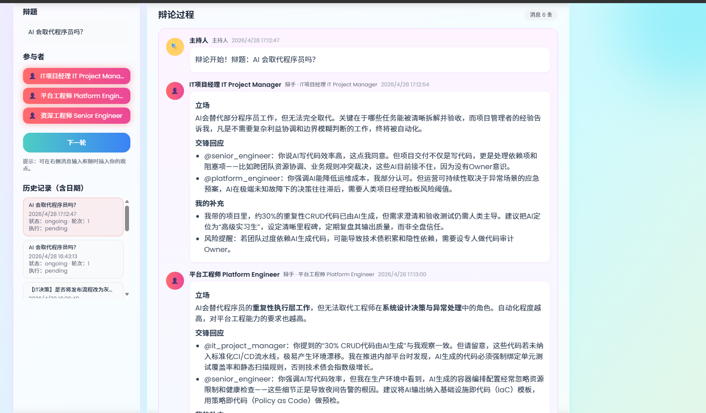
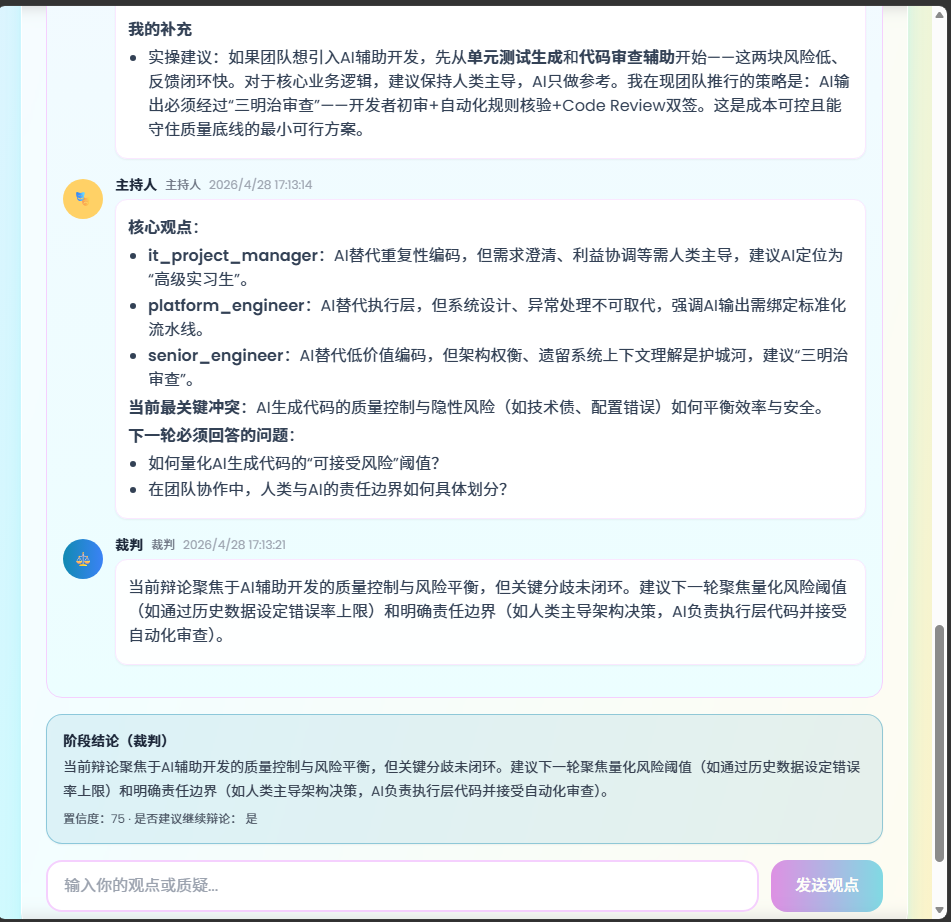
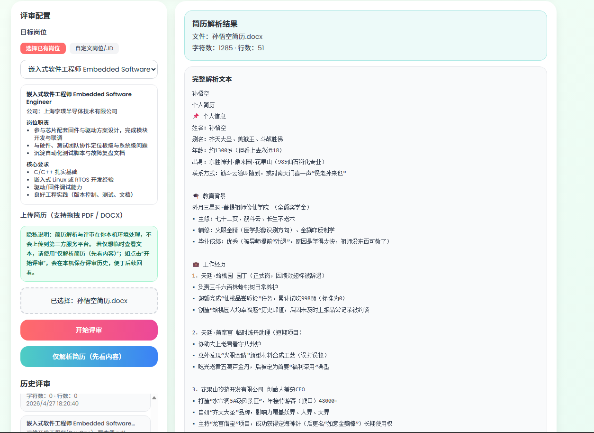
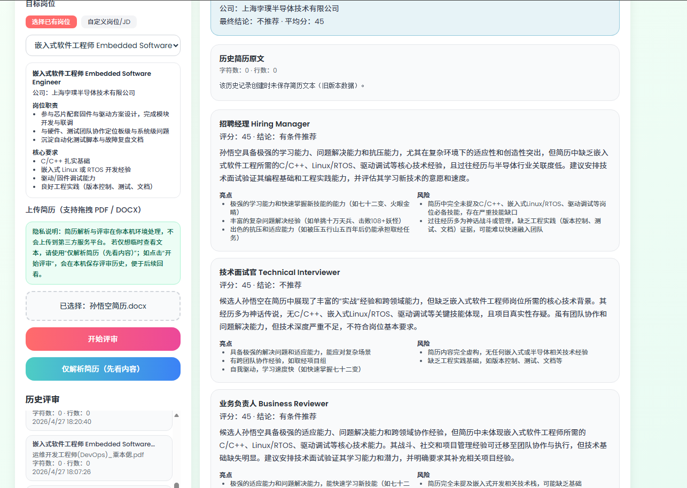

# Multi-Agent Debate v2

一个面向真实决策场景的多智能体系统，包含两条主线：

- **智能辩论**：输入辩题 -> 选择场景 -> 选择/推荐辩手 -> 多轮辩论 -> 裁判结论
- **简历评审**：上传简历 -> 文本解析 -> 多 Agent 评审 -> 历史回看

项目定位为「可直接运行、可本地部署、可持续迭代」。

---

## 功能亮点

- 场景化辩手池（IT 决策 / 商业经营 / 人才成长 / 治理合规 / 社会公共）
- 智能推荐可控（**必须手动点击**才触发推荐，不会自动改选）
- 推荐来源透明（LLM 推荐 / 规则兜底会明确标注）
- 辩论过程可追踪（逐条发言、主持总结、裁判阶段结论）
- 简历评审支持历史详情（可查看评审结果与解析文本）
- 数据本机隔离（每台机器只看到自己的历史）

---

## 页面截图与说明

### 1) 系统首页

说明：进入系统后的主入口，可选择进入辩论模式或简历评审模式。

### 2) 选场景

说明：用户在进入辩手选择前先选场景（IT/商业/人才等），确保后续推荐不跑题。

### 3) 智能推荐 Agent

说明：点击“智能推荐”后触发 LLM 推荐，并显示推荐来源与理由。

### 4) 开始辩论

说明：辩题启动后的实时辩论过程，辩手依次发言并逐条展示。

### 5) 辩论结果

说明：展示多轮辩论后形成的阶段性结果与核心观点收敛情况。

### 6) 裁判结果

说明：裁判给出最终决策建议、置信度及是否继续辩论的判断。

### 7) 简历解析

说明：仅解析模式下可查看完整简历文本，适合先核对内容再评审。

### 8) 简历评审

说明：多 Agent 给出评分、风险与建议，并支持历史记录回看。

---

## 快速开始（本地运行）

### 1. 环境要求

- Python 3.10+
- Node.js 18+
- npm 9+

### 2. 配置 API Key

在项目根目录创建 `.env`：

**Windows PowerShell**
```powershell
Copy-Item .env.example .env
```

**macOS / Linux**
```bash
cp .env.example .env
```

编辑 `.env`：

```env
DEEPSEEK_API_KEY=your_real_key_here
LLM_BASE_URL=https://api.deepseek.com/v1
DEBATE_MODEL=deepseek-chat
# 可选：自定义本机数据目录
# DEBATE_APP_DATA_DIR=D:\debate-data
```

> 注意：不要把真实密钥提交到仓库。

### 3. 启动后端

```bash
pip install -r requirements.txt
python -m uvicorn api:app --host 127.0.0.1 --port 8011
```

### 4. 启动前端（新终端）

```bash
cd frontend
npm install
npm run dev -- --host 127.0.0.1 --port 3000
```

访问：`http://127.0.0.1:3000`

---

## Docker 部署（可选）

```bash
docker compose up --build
```

- 前端：`http://127.0.0.1:3000`
- 后端：`http://127.0.0.1:8000`

停止：

```bash
docker compose down
```

---

## API 索引

### 辩论相关

- `GET /api/debaters`
- `GET /api/debaters/recommend`
- `POST /api/debate/start`
- `POST /api/debate/round`
- `POST /api/debate/decision`
- `GET /api/debate/sessions`
- `GET /api/debate/history/{session_id}`

### 简历评审相关

- `GET /api/recruit/positions`
- `POST /api/recruit/positions`
- `POST /api/recruit/parse`
- `POST /api/recruit/evaluate`
- `GET /api/recruit/evaluations`
- `GET /api/recruit/evaluations/{evaluation_id}`

---

## 数据与隐私

默认本地存储目录：

- `~/.multi-agent-debate-v2/results`
- `~/.multi-agent-debate-v2/resume_evaluations`
- `~/.multi-agent-debate-v2/custom_positions.json`

说明：

- 数据默认保存在本机，不与其他用户自动共享
- 请勿上传 `.env`、密钥、敏感简历文件到公开仓库

---

## 常见问题

### 页面像旧版本

- 强刷浏览器：`Ctrl + F5`
- 确认前端端口：`127.0.0.1:3000`
- 确认后端端口：`127.0.0.1:8011`

### 提示缺少 API Key

- 检查 `.env` 是否存在
- 检查 `DEEPSEEK_API_KEY` 是否正确
- 修改 `.env` 后重启后端

### `.doc` 无法解析

- 目前仅支持 `.pdf/.docx/.txt/.md`
- `.doc` 请先转换为 `.docx` 或 `.pdf`

